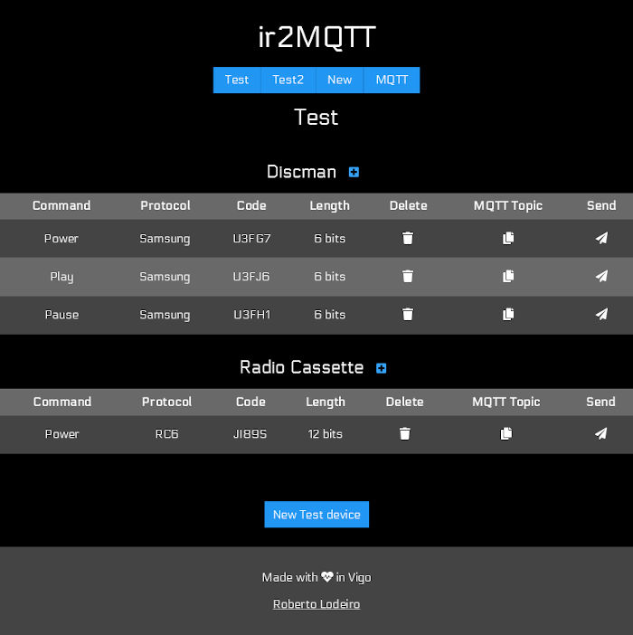
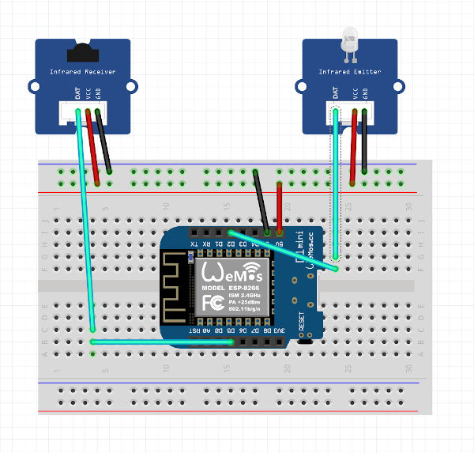

# ir2MQTT
Web application + hardware (ESP8266) for managing and send IR codes.

The web interface allows to save IR codes organized by room and device. The IR codes are read by the hardware and copied directly to the interface. In addition, the interface allows direct connection to the MQTT broker to send the IR codes by sending these to the hardware.

* The MQTT broker must have the WebSocket protocol enabled.

## Features

* Simply manage all the IR codes of the house.
* Receive new IR codes and save them in the database.
* Copy the MQTT topic associated with a command to use it from external applications.
* Send the IR code directly to the hardware.

### Important

To facilitate the integration with external systems such as openHAB, some of the MQTT protocol rules have been skipped.

The IR code, instead of being sent in the payload, is sent in the topic itself. This topic will be generated by the application's own interface to facilitate the process.

The structure used is the following:

```txt
ir2MQTT/<room_name>/SEND/<ir_protocol>;<ir_code>;<ir_length>
```

## Application

The backend manage the database and serve the web interface.

* Interface with two example rooms, "Test" and "Test2":



You can <a href="https://github.com/Lodeiro0001/ir2MQTT/releases" target="_blank"> download here </a> the binary for your system.

### Use

Just run the binary, the web interface will be available at http://localhost:8420

In the first run, the database will be created as `ir2MQTT.sqlite`.

* It's important to keep the database and the `gui` folder at the executable's directory.

## Hardware

To be able to send and receive the IR codes, it's necessary to have a board based on ESP8266 flashed with the code available in `/src/hardware/ir2MQTT`. Modify the indicated values ​​in the code.

Two modules connected to the ESP8266 are required, Infrared Receiver and Infrared Emitter.

Tested on Wemos D1 and Wemos D1 mini.

### Connections

* Infrared Receiver: DAT -> Port D5
* Infrared Emitter: DAT -> Port D2



### Used libraries

* <a href="https://github.com/markszabo/IRremoteESP8266/" target="_blank"> IRremoteESP8266 </a>
* <a href="https://github.com/knolleary/pubsubclient" target="_blank"> PubSubClient </a>
* <a href="https://github.com/eng8266/Arduino/tree/master/libraries/ESP8266WiFi" target="_blank"> ESP8266WiFi </a>

### Compilation and firmware uploading

<a href="https://www.arduino.cc/en/Main/Software" target="_blank"> Arduino IDE </a> is required.

#### 1. Clone the repository

```bash
git clone https://github.com/Lodeiro0001/ir2MQTT
```

[or download it here](https://github.com/Lodeiro0001/mqtt-ir-transceiver/archive/master.zip)

#### 2. Open ir2MQTT.ino with Arduino IDE

#### 3. Connect your ESP8266 and select the serial port

#### 4. Modify the parameters indicated in the code

Remember: `CLIENT_NAME` will be part of the MQTT topic. You should use the same name in the web interface for the room field. 

#### 5. Upload to ESP8266!

## Integration with OpenHab

It's assumed that the MQTT broker has already been configured in openHAB. This must be the same as the used by the ESP8266 board.

### Example of item configuration

```java
Group gIR2MQTT
Switch ir_bedroomTV_POWER
        "Bedroom TV Power" <switch> (gIR2MQTT)
        {mqtt = "> [mosquitto: ir2MQTT / Bedroom / SEND / 3; 20DF23DC; 32: command: *: default]", autoupdate = "false"}
Switch ir_bedroomTV_HDMI1
        "Bedroom TV HDMI1" <switch> (gIR2MQTT)
        {mqtt = "> [mosquitto: ir2MQTT / Bedroom / SEND / 3; 20DF738C; 32: command: *: default]]", autoupdate = "false"}
```

### Use in rules

```java
rule "Bedroom TV ON"

when
        Item motion-sensor_bedroom changed from OFF to ON
then
        sendCommand (ir_bedroomTV_POWER, ON)
end
`` `

```java
rule "Bedroom TV HDMI1"

when
        Item button_bedroom received update double
then
        sendCommand (ir_bedroomTV_HDMI1, ON)
end
```
